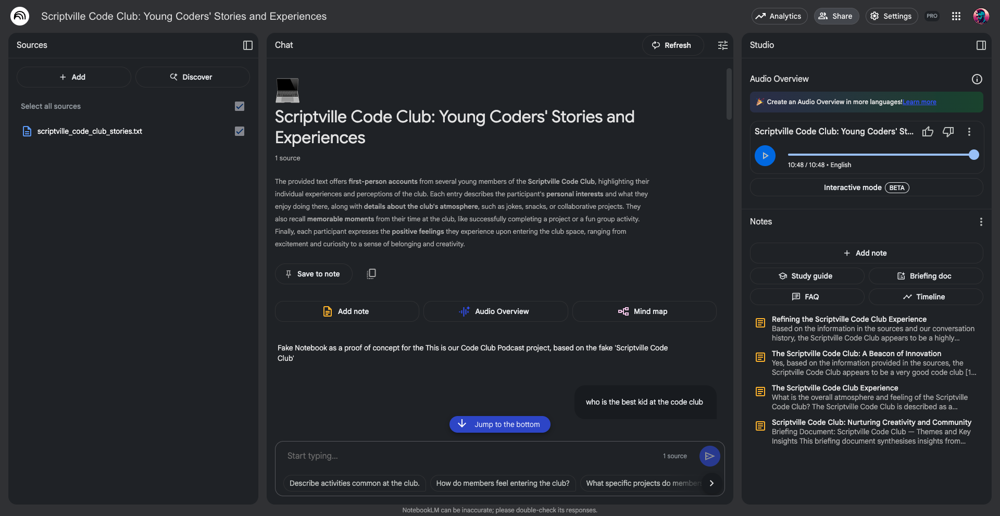

## What you will make

You'll create a `.txt` file containing your answers to a few simple prompts about your Code Club.

Your leader will collect everyone’s `.txt` files and feed them into an AI system (a large language model, or LLM) called **NotebookLM** that turns your words into a podcast that sounds just like the real thing!

You don’t need to record anything. You don’t need to be a professional writer.

You just need to tell us about your Code Club, in your own words.

### Note for Club leaders
Club leaders can download and use the [mentor helpsheet](resources/Podcast_LeaderPDF-combined.pdf) for tips on getting started.

### Listen

--- task ---

You can play an example podcast about a made-up Code Club here:

<audio controls style="width:100%;max-width:448px;">
  <source src="images/ccpodcast.mp3" type="audio/mpeg">
  Your browser doesn’t support the <code>&lt;audio&gt;</code> element —
  <a href="images/ccpodcast.mp3">download the file instead</a>.
</audio>

--- /task ---

### Tell your story

This is your chance to share what Code Club means to you.

You’ll write about your club — what you love, what you remember, what makes it yours. 

Then, your writing will become a real podcast, and a fun, shareable story about your club!

Let's get started!

