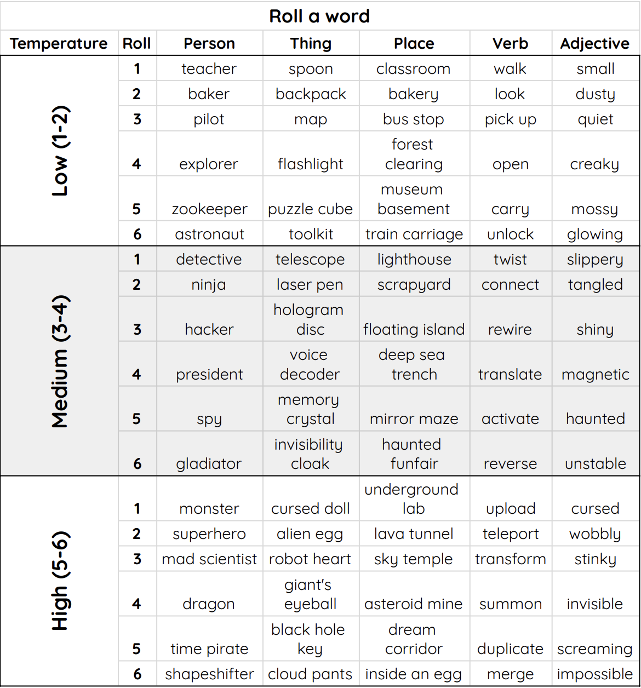

## Unplugged Activity: LLM Storytime

While you wait for the LLM to create your new podcast, play a fun Unplugged game with your creators where they use dice to make crazy stories, and learn a little bit about how LLMs create sentences.

### Overview:

You're training an AI system called an **LLM** that uses your stories to answer questions, and make a podcast with AI voices. But an LLM like NotebookLM doesn’t actually think, or understand *anything*: it just guesses what seems like it should come next in a sentence.

The higher the “temperature” set for the LLM, the wilder its guesses get. Use dice rolls to control the **temperature** of a story and see what your LLM comes up with!

### You’ll Need:
- 6 sided die ([or make your own from paper here](resources/dice.pdf){:target="_blank"})
- Pencil
- Handout ([available here](resources/LLMStorytime_creator.pdf){:target="_blank"})

### Be an LLM

--- task ---

**Set the Temperature**

Choose which table to use by rolling the dice:

1-2 \= Low (predictable and safe)  
3-4 \= Medium (balanced and interesting)  
5-6 \= High (random and wild)

This determines which table you should use below when creating your stories.

--- /task ---

### Generate a Story

  In a [<strong>adjective</strong>] [<strong>place</strong>], 
  a [<strong>person</strong>] found a 
  [<strong>adjective</strong>] [<strong>thing</strong>]. 
  Curious, they tried to [<strong>verb</strong>] it, 
  but that only made things [<strong>adjective</strong>]. 
  Moments later, something [<strong>adjective</strong>] happened 
  when a [<strong>adjective</strong>] [<strong>person</strong>] 
  appeared and had to [<strong>verb</strong>] it immediately!

--- task ---
Roll the dice for each bold word above, and look up your words on the table below. 
Your total determines the row (1–6) from the word table. Higher rolls \= stranger words.
--- /task ---

###  Word Table

--- task ---

Once you have generated a story or two, get ready to share one with the group!

Was your story low, medium or high temperature?

--- /task ---

### Discussion

--- task ---

**What’s the weirdest verb (doing word) you can think of?🤔**

It’s pretty hard to do! Think - ‘what makes it *weird’*? 
What's the most 'boring' doing word?

--- /task ---

--- task ---

**How does temperature affect the story our pretend LLM generated?** 

When you talk about the ‘temperature’ of an LLM like ChatGPT, what you’re really talking about is how random and strange the words it will use are. Lower temperature means it will use more likely and ‘normal’ words in your output, while high temperature means weirder, less likely words.

--- /task ---

By now, your podcast should be ready to listen to! 